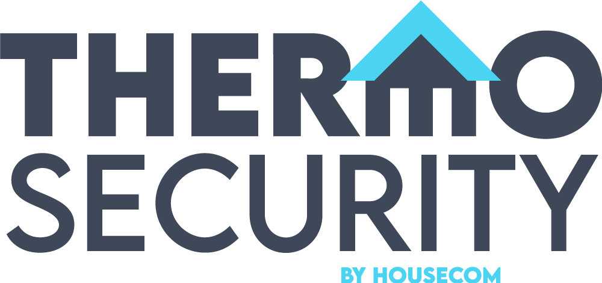

# THERMOSECURITY by Housecom – Hackathon Project



**THERMOSECURITY** is an interactive, mobile-first, one-page web application developed during the **Housecom Hackathon** as a remake of a school assignment.
The goal of the project was to create an engaging user experience using a combination of **3D visuals** and **still images**.
All content is original to the school project and has not been modified or expanded beyond the original scope.

**Technologies used:** HTML, CSS, JavaScript, 3D assets, Live Server (for local development)

---

## Installation and Running

To use the application locally, follow these steps:

### Clone the repository

Using SSH:

```bash
git clone git@github.com:perzzzy/Web_App_Hackathon.git
```

Using HTTPS:

```bash
git clone https://github.com/perzzzy/Web_App_Hackathon.git
```

### Navigate to the project directory

```bash
cd Web_App_Hackathon
```

### Or download as ZIP

Go to the repository, click the green **Code** button, and select **Download ZIP**.

---

## Run the Application

This project is a front-end web application.
To run it locally:

* Open the project folder in your code editor (e.g. VS Code)
* Use a **Live Server** extension or any local web server
* Open the project in your browser through the local server

The application will now be accessible in your browser.

---

## Usage

1. Open the application using a local server.
2. Navigate through the one-page interface.
3. Interact with the visual content and 3D elements.
4. Explore the mobile-first layout and user experience design.

---

## License

This project is licensed under the **MIT License**.
You are free to use, modify, and distribute the project under the terms of this license.
